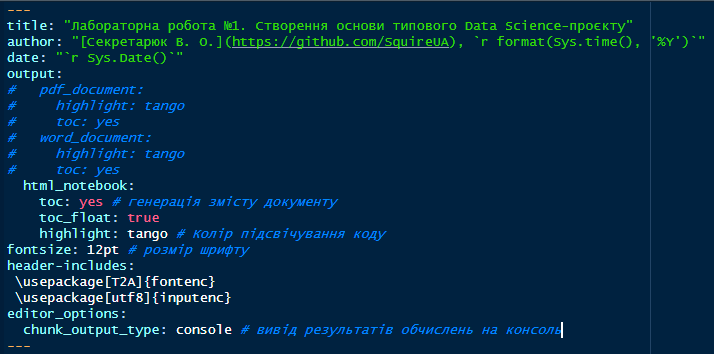

__Мета:__ _"Швидкий старт" для створення бази Data Science-проекту у середовищі RStudio із застосуванням концепції "грамотного програмування" засобами мови програмування R, пакету RMarkdown та системи комп'ютерної верстки LaTeX_. 

## Приклад створення Markdown-документу

### Постановка задачі

Побудувати графік функції $y(x)=b_ox+b_1+b_2x^2$ для діапазону $x \in [x_1;x_2]$.


### Виконання завдання


1. Створюємо документ R Markdown.

2. Налаштовуємо потрібним чином YAML-заголовок документу, у якому задаються метадані всього документу (рис. 1).




3. Пишемо код на R засобами базової графіки у відповідній зоні, яка називається чанком:


```{r}

# Задаємо параметри функції
b0 <- 2
b1 <- 3
b2 <- 1.57

# Задаємо область визначення

x <- seq(0, 10, 0.5)
y <- b0 + b1 * x + b2 * x^2

plot(x, y,
     type = "l",
     col = "red",
     main = "Графік функції",
     xlab = "x",
     ylab = "y"
     )
points(x, y,
       col = "blue")

df <- data.frame(x = x, y = y) # створюємо таблицю даних

```
4. Продемонструємо можливості пакету `rio` [@rio] для експорту (імпорту) даних на диск (з диску).

```{r}
# install.packages("rio") # інсталяція пакету
library(rio) # підключення пакету
export(df, "data/data.csv")

```
5. Виконуємо імпорт даних із файлу і візуалізацію у вигляді таблиці. 

```{r results='asis'}
dfNew <-  import("data/data.csv")

# Таблиця засобами knitr
knitr::kable(head(dfNew),
             caption = "_Табл. 1. Фрагмент таблиці даних_")


# Таблиця засобами stargazer
# stargazer::stargazer(head(dfNew),
#                      type = "html",
#                      summary = FALSE,
#              title = "_Табл. 1. Фрагмент таблиці даних_")


# Таблиця засобами xtable
# print(xtable::xtable(head(dfNew),
#                      type = "html",
#                      html.table.attributes="border=0",
#                      summary = FALSE,
#              caption = "_Табл. 1. Фрагмент таблиці даних_"))

```

6. Формуємо результуючу таблицю.

_Табл. 2. Параметри функції_

Параметр | Значення
-----|-----
$b_0$| `r b0`
$b_1$| `r b1`
$b_2$| `r b2`
$x_1$| `r min(x)`
$x_2$| `r max(x)`

## Індивідуальні завдання

### Перше завдання

Побудувати графік функції $y(x)=\frac{ax^3-bx+c}{tan(x)}$ для діапазону $x \in [x_1;x_2]$.

1. Пишемо код на R засобами базової графіки у відповідній зоні з викоривтання ggplot2[@ggplot2]:

```{r}

# Задаємо параметри функції
a1 <- 3
b1 <- 4
c1 <- 1

# Задаємо область визначення

x <- seq(-5, 5, .5)
y <- (a1 * x^2 - b1 * x + c1)/x |> tan()

df <- data.frame(x = x, y = y) # створюємо таблицю даних

library(ggplot2)

# Create a red lineplot in ggplot2     
ggplot(df, aes(x = x, y = y)) +
       geom_line(color = "red")+
       geom_point(color = "blue") +
       labs(x = 'X', y = 'Y', title = 'Графік функції', caption = 'Зображення зроблено за допомогою ggplot2')+
       theme_dark()

```
2. Виконуємо експортуємо даних у файл _data2.csv_.

```{r}

library(rio) # підключення пакету
export(df, "data/data2.csv")

```
3. Виконуємо імпорт даних із файлу і візуалізацію у вигляді таблиці. 

```{r results='asis'}
dfNew <-  import("data/data2.csv")

# Таблиця засобами knitr
knitr::kable(head(dfNew),
             caption = "_Табл. 3. Фрагмент таблиці даних першого індивідуального завдання_")

```

4. Формуємо результуючу таблицю.

_Табл. 4. Параметри функції першого індивідуального завдання_

Параметр | Значення
-----|-----
$a$| `r a1`
$b$| `r b1`
$c$| `r c1`
$x_1$| `r min(x)`
$x_2$| `r max(x)`

### Друге завдання

Побудувати графік функції $y(x)=\frac{\sqrt{(a+b)^{cos(x)}}}{c}$ для діапазону $x \in [x_1;x_2]$.

1. Пишемо код на R засобами базової графіки у відповідній зоні з викоривтання ggplot2[@ggplot2]:

```{r}

# Задаємо параметри функції
a2 <- 8
b2 <- 4
c2 <- -8

# Задаємо область визначення

x <- seq(-5, 5, .5)
y <- (a2+b2)^(cos(x)) |> sqrt()/c2

df <- data.frame(x = x, y = y) # створюємо таблицю даних

library(ggplot2)

# Create a red lineplot in ggplot2     
ggplot(df, aes(x = x, y = y)) +
       geom_line(color = "red")+
       geom_point(color = "blue") +
       labs(x = 'X', y = 'Y', title = 'Графік функції', caption = 'Зображення зроблено за допомогою ggplot2')+
       theme_dark()

```
2. Виконуємо експортуємо даних у файл _data3.csv_.

```{r}

library(rio) # підключення пакету
export(df, "data/data3.csv")

```
3. Виконуємо імпорт даних із файлу і візуалізацію у вигляді таблиці. 

```{r results='asis'}
dfNew <-  import("data/data3.csv")

# Таблиця засобами knitr
knitr::kable(head(dfNew),
             caption = "_Табл. 5. Фрагмент таблиці даних другого індивідуального завдання_")

```

4. Формуємо результуючу таблицю.

_Табл. 6. Параметри функції другого індивідуального завдання_

Параметр | Значення
-----|-----
$a$| `r a2`
$b$| `r b2`
$c$| `r c2`
$x_1$| `r min(x)`
$x_2$| `r max(x)`

# References

